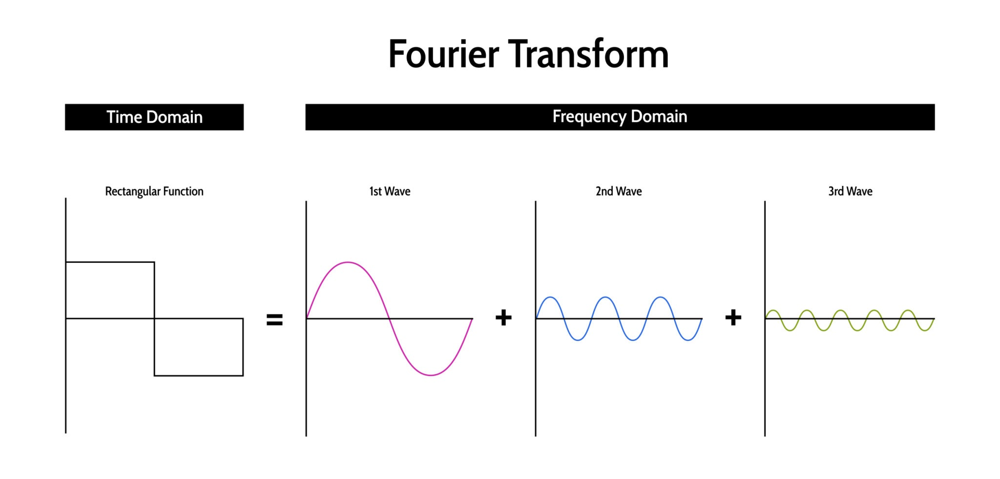

# ⚡ Analog Discovery 3 実践課題

## テーマ：見えない「電気」と「情報」を可視化せよ

基本操作（ループバックテスト）で波形が出せるようになったら、次のステップに進みます。
この3つのミッションを通して、電気信号の「速さ」「情報」「成分」を解き明かしましょう。

---

## 🛑 ミッション1：人間の目の限界に挑め
**〜その光は点いているか、消えているか〜**

電気信号のスピードを変えることで、人間の目がどう騙されるか（残像現象）を体験します。

### 🛠 準備
* Analog Discovery 3 (AD3)
* LED × 1個
* 抵抗（330Ω）× 1個
* ブレッドボード、ジャンパーワイヤ

### 1. 回路を作る
AD3の信号（黄色）でLEDを光らせる回路を組みます。

1. **信号入力:** AD3の **黄色い線 (W1)** を抵抗の片側につなぐ。
2. **LED接続:** 抵抗のもう片側を、LEDの **足の長い方（アノード）** につなぐ。
3. **GND接続:** LEDの **足の短い方（カソード）** を、AD3の **黒い線 (GND)** につなぐ。

### 2. 信号を送る (Wavegen)
1. WaveFormsの **「Wavegen」** を開きます。
2. 設定を以下に変更して **「Run」** を押します。
   * **Type:** Square（四角い波）
   * **Frequency:** 1 Hz（1秒に1回）
   * **Amplitude:** 2 V（明るさ）
   * **Offset:** 2 V（0V〜4Vの間で動かすため）
   * 👉 **確認:** LEDが「チカ、チカ」と点滅していますか？

### 3. 実験（スピードアップ）
Frequency（周波数）の数字を書き換えて、見え方の変化を観察しよう。

* **5 Hz:** まだ点滅して見える？
* **20 Hz:** チラつき（フリッカー）を感じる？
* **50 Hz 〜 100 Hz:** どう見える？

> **📝 考察:**
> なぜLEDはずっと点滅しているはずなのに、止まっているように見えるのだろう？
> この現象は、身の回りのどんな技術（アニメ、蛍光灯など）に使われているかな？

---

## 📺 ミッション2：見えない信号をハッキングせよ
**〜テレビのリモコンが送っている「暗号」を解読する〜**

普段見えない「デジタル通信（0と1の信号）」を、ロジックアナライザを使って捕まえます。

### 🛠 準備
* 赤外線受信モジュール
* テレビなどのリモコン

### 1. 電源とセンサーの準備
AD3からセンサーへ電気を供給します。（※配線はセンサーの仕様を確認すること！）

1. **電源プラス:** AD3の **赤い線 (V+)** ➡ センサーの **VCC**
2. **電源マイナス:** AD3の **黒い線 (GND)** ➡ センサーの **GND**
3. **信号線:** AD3の **ピンクの線 (0)** ➡ センサーの **OUT**

### 2. 電源ON (Supplies)
1. メニューの **「Supplies」** をクリック。
2. **Master Enable is OFF** ボタンを押して **ON**（青色）にします。

### 3. 待ち伏せ設定 (Logic)
一瞬の信号を逃さないよう「罠（トリガー）」を仕掛けます。

1. メニューから **「Logic」** をクリック。
2. **「+」** ボタンで **DIO 0** を追加します。
3. **トリガー設定:**
   * 画面右上の `Trigger` を `Auto` から **`Normal`** に変更。
   * DIO 0 の行にある `T` 欄をクリックし、**「Falling Edge（⬇）」** を選択。
4. 左上の **「Single」** ボタンを押す（ステータスが `Armed` になれば準備OK）。

### 4. 実験
1. センサーに向かってリモコンのボタンを「ピッ」と押す。
2. **成功:** 画面にバーコードのような波形が表示されるはず！
3. **リセット:** 次のボタンを試すときは、もう一度 **「Single」** を押して画面をクリアしよう。

> **📝 考察:**
> 波形を拡大してみよう。信号の「長さ」が違う場所があるかな？
> これがデジタル信号の「0」と「1」の正体だ。

---

## 🎻 ミッション3：音の成分を分解せよ
**〜「音色」の違いを目で見て理解する〜**

複雑な波形の中に「どんな周波数の波」が隠れているか、FFT（周波数解析）で分析します。

### 🛠 準備
* 部品不要（AD3の配線のみ）

### 1. ループバック接続
1. **黄色 (W1)** と **オレンジ実線 (1+)** をつなぐ。
2. **黒 (GND)** と **オレンジ縞 (1-)** をつなぐ。

### 2. 「単純な波」を見る
1. **Wavegen:** Frequency **1kHz**、Type **Sine（正弦波）** を出力。
2. **Spectrum:** メニューから「Spectrum」を開いて **「Run」**。
   * 👉 **観察:** グラフの横軸「1kHz」の場所にだけ棒が立っているね？（純粋な音）

### 3. 「複雑な波」を見る
1. **Wavegen:** Type を Sine から **Square（方形波）** に変更。
   * ※ファミコンのような「ビー」という音の波形。
2. **Spectrum:** グラフの変化を見る。

> **📝 考察:**
> さっきは1本だったのに、**1kHz, 3kHz, 5kHz...** とたくさんの棒が出現したはず。
> 実は、あらゆる音（四角い波も、人の声も）は、「たくさんの正弦波の足し算」でできているんだ。
> **Triangle（三角波）** に変えると、棒の高さはどう変わるかな？

すべての波（の形、波形）は、周波数の異なる正弦波 (sin 波) に分解できます。これを **フーリエ変換** といいます。

  

